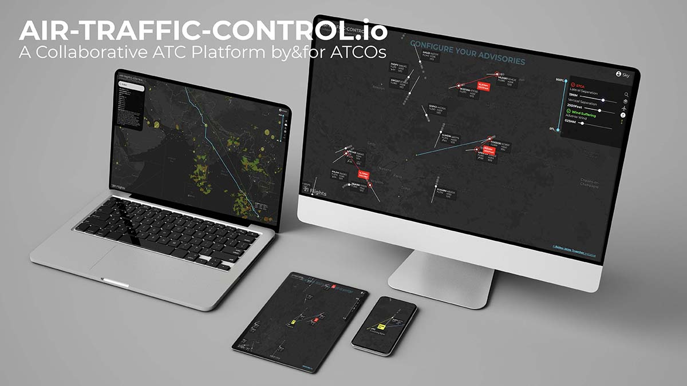

# The MasLow Project
The idea of getting everyone talking and building an Air Traffic Control platform from the ground up by and for air traffic controllers (ATCO) could be game changing in aviation industry. 

     
**MasLow** is the foundation on which air-traffic-control.io (https://bit.ly/3Hrc7zs) is built. An Open Source platform intending to build the future of ATC, and this can only happen starting from scratch, jointly with most open-minded and motivated people. 

Special Thx to ATCOs from all over the world: Luis Barbero, Pavol Sitar, Tom Laursen, Anthony Ang, Nadia Bamowongo, Angel Augusto, Anicet Coffie, Jasser Letaief, Timothy Agaba, Kijeon, Navneet Singh Rana, Ivan Radović, Osman Atilla Altintas...

You are a Tech guy?
Join the movement, and imagine what the future of Air Traffic Control will be...

This repository contains the basic features used by an air traffic controller. 

## Repository structure
Client Side:
- /client: this directory contains the react client side (front-end)
- /client/src/App/conf.json: this file contains parameters to update including MapBox Token (Get it for free from https://account.mapbox.com/)

Server Side:
- /server: this directory contains the nodejs server side (back-end)
- /server/config/conf.json: this file contains the path and credentials to access Aviation Data Services (Real Time Aircraft Tracks and Flight Plans)
"avdClientId": "<THALES_AVIATION_DATA_CLIENT_ID>",
"avdClientSecret": "<THALES_AVIATION_DATA_CLIENT_SECRET>"

## Installation
- Clone the repository
- Run `yarn install` in project root, client and server folder (`./install.sh`)
- Fill the credentials (MapBox Token (/client/src/App/conf.json) and Tracks and Flight Plans AVD Feeder (/server/config/conf.json)
- Launch `./start-dev.sh`

## Questions?
In case of MasLow related questions:
- Have a look at the live ATC Platform https://bit.ly/3Hrc7zs
- Contact me
  - Email: [areski.hadjaz@thalesdigital.io](mailto:areski.hadjaz@thalesdigital.io)
  - LinkedIn: https://www.linkedin.com/in/areskihadjaz/ 

